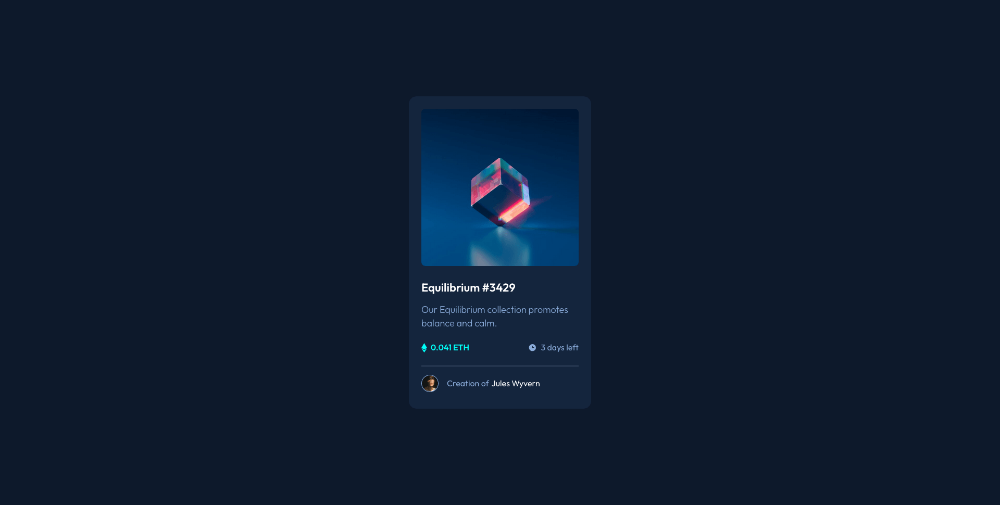
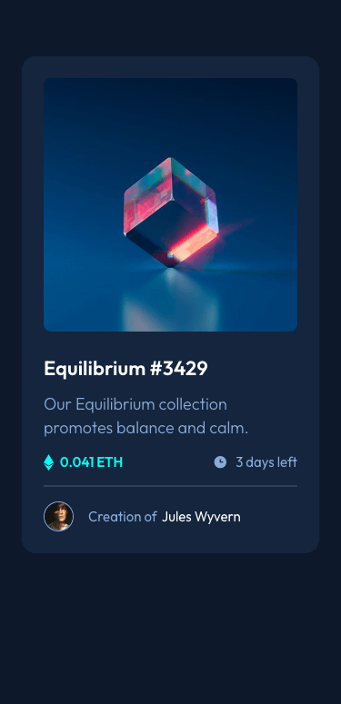

# Frontend Mentor - NFT preview card component solution

This is a solution to the [NFT preview card component challenge on Frontend Mentor](https://www.frontendmentor.io/challenges/nft-preview-card-component-SbdUL_w0U). Frontend Mentor challenges help you improve your coding skills by building realistic projects.

## Table of contents

- [Overview](#overview)
  - [The challenge](#the-challenge)
  - [Screenshot](#screenshot)
  - [Links](#links)
- [My process](#my-process)
  - [Built with](#built-with)
  - [What I learned](#what-i-learned)
  - [Continued development](#continued-development)
  - [Useful resources](#useful-resources)
- [Author](#author)

## Overview

### The challenge

Users should be able to:

- View the optimal layout depending on their device's screen size
- See hover states for interactive elements

### Screenshot




### Links

- Solution URL: [https://github.com/srijanss/nft-preview-card-component](https://github.com/srijanss/nft-preview-card-component)
- Live Site URL: [https://srijanss.github.io/nft-preview-card-component/](https://srijanss.github.io/nft-preview-card-component/)

## My process

### Built with

- Semantic HTML5 markup
- CSS custom properties
- Flexbox
- CSS Grid
- Mobile-first workflow
- [Vite](https://vitejs.dev/) - Lightweight frontend tooling
- [PostCSS](https://postcss.org/) - Tool to transform CSS using plugins

### What I learned

- I learned how to use BEM methodology for CSS.

```html
<article class="card">
  <figure class="card__figure card__figure--main">
    
    <figcaption class="card__caption is-hidden">
      Main image of Equilibrium #3429 card
    </figcaption>
  </figure>
  <h1 class="card__heading">
    <a class="card__link" href="#">Equilibrium #3429</a>
  </h1>
  <p class="card__body">
    Our Equilibrium collection promotes balance and calm.
  </p>
</article>
```

```css
.card {
  --card-width: 327px;
  --card-height: auto;

  width: var(--card-width);
  height: var(--card-height);
  margin: 0 auto;
  background-color: var(--color-very-dark-blue-card-bg);
  border-radius: 15px;
  padding: 1.5rem;

  &__heading {
    @mixin heading-styles;

    margin-top: 1.5rem;
  }

  &__body {
    @mixin body-styles;

    color: var(--color-soft-blue);
    margin-top: 0.75rem;
  }

  &__link {
    color: var(--color-white);
    text-decoration: none;

    &:hover {
      color: var(--color-cyan);
    }
  }
}
```

### Continued development

I am planning to use other CSS methodologies like CUBE CSS, SMACSS, and Atomic CSS for this project in different branch. I am also planning to use more CSS frameworks like Tailwind CSS and Bootstrap to improve my CSS skills.

### Useful resources

- [Web Components](https://developer.mozilla.org/en-US/docs/Web/API/Web_components/Using_custom_elements)
- [BEM](https://en.bem.info/methodology/)

## Author

- Website - [Srijan Manandhar](https://github.com/srijanss)
- Frontend Mentor - [@srijanss](https://www.frontendmentor.io/profile/srijanss)
